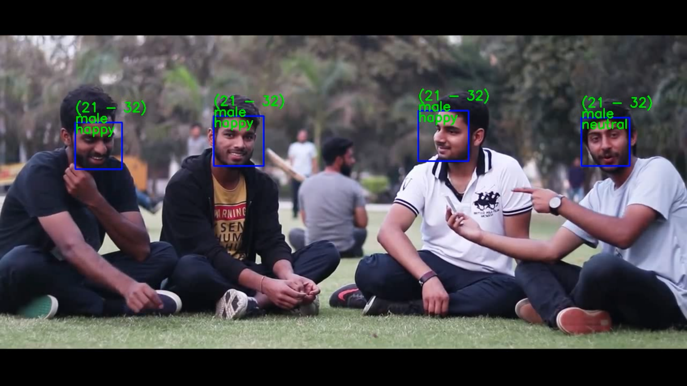
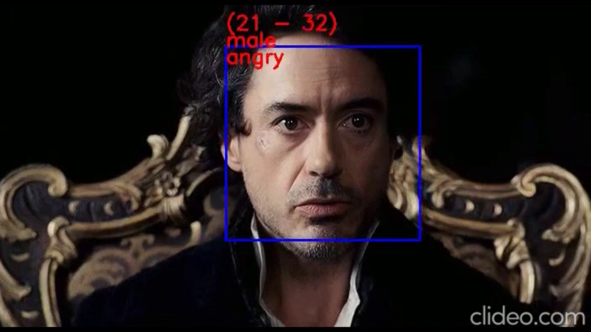
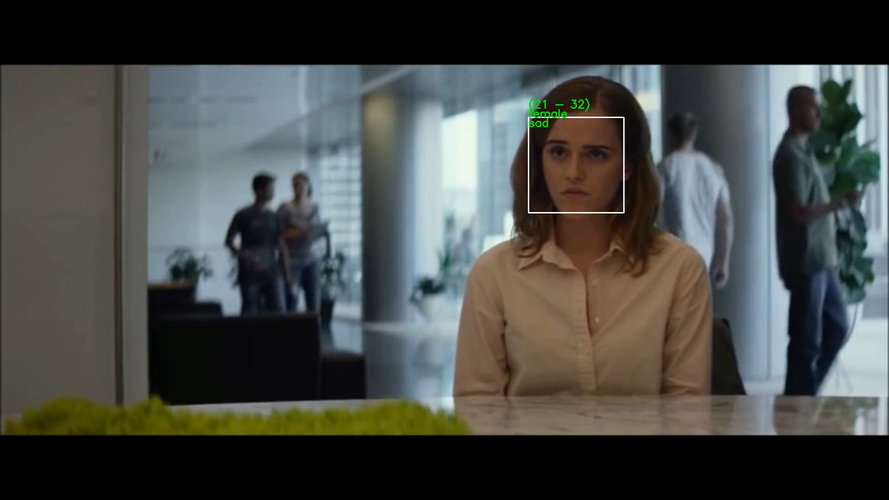
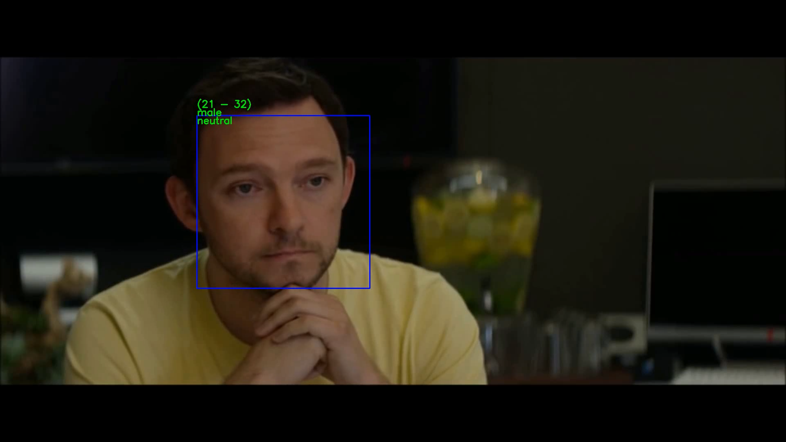

# Gender Age and Expression Detector

This Project detect 
1. Gender(Male/Female)
2. Age in range 0-6, 8-12, 15-20, 21-32, 35-43, 48-53, 60-100
3. Emotion as Neutral, Happy, Sad, Fear, Angry, Surprise.


## Requirements

1. OpenCV
2. fastai
3. shutil
4. pandas

## Data
Data for age and gender is taken from [here](https://talhassner.github.io/home/projects/Adience/Adience-data.html)
This contain data of 26,580 faces of 2284 subjects
It will contain files starting with 'fold_', These files contain information about the images like gender, age etc.

Data for expression is taken from kaggle
This contain folders containing data for argry, happy, fear, neutral, sad, surprise, disgust.


## Processing Data

To get better result we the images grayscale. Expression data will be already gray, but age and gender will not. To do so we have a file `creating_grayscale.py`. 
We can also add a grayscale transform while doing data augmentation and skip this step but keep in mind that sometimes the transform is only applied in training data which will decrease your accuracy.


### Gender
There is a file named `creating_test_train_val.py`. This python file contain various functions like making_folder which create folders, coping_files which copy files to test, train folder, making_test_train which compare the name of these files with that given in 'fold_' files which we get with dataset and create the male and female folders and move files inside these folders, make_val function make the validation data.


As the number of files in male and female folders will be different, to get better result, the best practise is to make the number of files in these folders same, by coping and pasting in the folder containing less files. For this there is a function named twich to do the same, twich_expression is for the expression dataset.


### Age
For age we make a csv file which contain columns as name(file_name), label(age_category) and is_val for validation data.
To do this we have a file named `making_age_csv.py`.


### Face Detection 
Face detection is done using the haarcascade which come with opencv.

## Models
Training code is present in `notebook` folder which contain the jupyter notebooks for gender, age and expression separetly.
Training is done on google colab.


## Testing
To test the code, add the trained models in `models` folder and run the `testing_gender_age_expression.py` with following args</br>
--image_input -> for testing a image</br>
--camera -> for testing video</br>
--video_output -> give the name and it store the file of that name</br>
--image_output -> give the name and it store the image of that name</br>


example - 
```bash
python testing_gender_age_expression.py --camera t1.mp4 --video_output out.mp4
```







